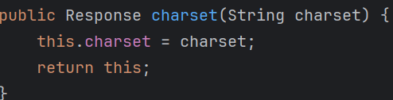
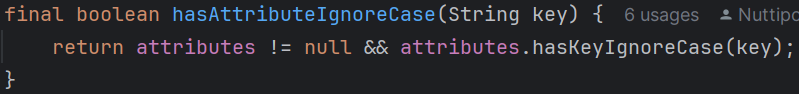
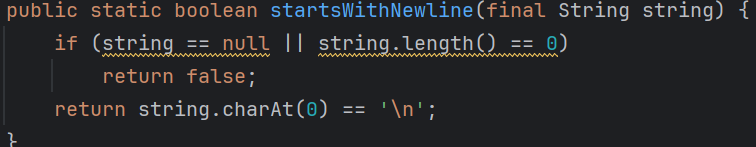
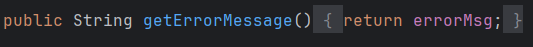
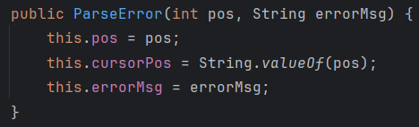
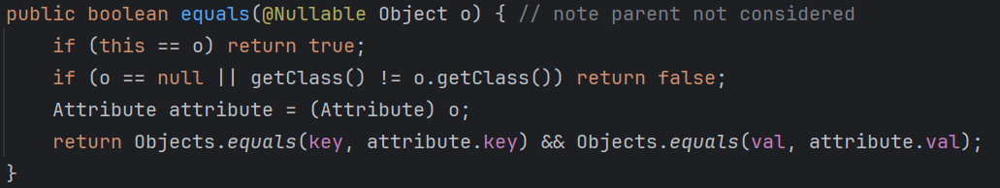
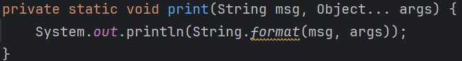
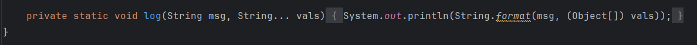
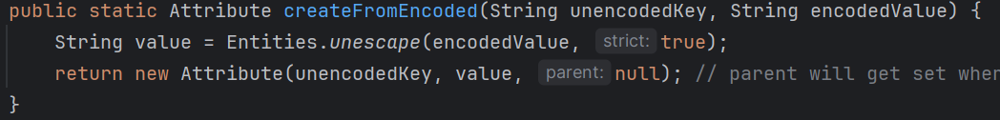

<span style="font-family: Times , sans-serif;">

# Jsoup (Maven)

**Jsoup** is a Java library that is a HTML parser, and is used to retrieve, read and manipulate real life HTML documents. It enables the developers to obtain data with CSS-like selectors and purify untrusted HTML data safely. In this JaCoCo coverage report, the project under test is Jsoup and this report indicates the percentage of its code which has been covered by the automated tests. The various packages like org.jsoup.parser, org.jsoup.nodes, org.jsoup.select, and others are the key functional components of the library and they are used to perform a specific task like parsing HTML, representing document nodes and selecting elements. The Coverage (%) columns show the percentage of the code in each package that was actually run in the course of testing. The sections of the code which were not tested are outlined in The Missed Instructions, Branches and Methods sections and allow developers to know which areas of Jsoup remain untested and require further test cases to be considered as fully reliable.

# Jacoco Coverage Report

**Jacoco** is a free Java code coverage tool that instruments bytecode to show how much of your code is exercised by tests (line, branch, instruction, class, method). It integrates with `Maven/Gradle/Ant, IDEs (IntelliJ/Eclipse), and CI (Jenkins/GitHub Actions), generating HTML/XML/CSV reports`; quick run: Maven mvn test jacoco:report, Gradle gradle test jacocoTestReport. Use it to find untested code and enforce minimum coverage in your build.

---

# Test Case #1

### **Name of the Test Case:**

    CharsetTest

### **Goal of the Test Case:**

To test function Response charset when receiving input type string. It will return response correctly.

### **Identify testable functions:**

`HttpConnection.java` - **line 977**
<br>

### **Identify parameters, return types, return values, and exceptional behavior:**

| Detail                   | Description                                                                                                   |
| ------------------------ | ------------------------------------------------------------------------------------------------------------- |
| **Parameter type**       | `String Charset`                                                                                                  |
| **Return type**          | `Response`                                                                                                     |
| **Return value**         |                                |
| **Exceptional behavior** |  |

---

### **Interface-based characteristic**

| **Characteristic**     | **Block 1**                       | **Block 2**                              | **Block 3**             |
| ---------------------- | --------------------------------- | ---------------------------------------- | ----------------------- |
| C1 = Parameter charset | input parameter is String example | input parameter isn’t String example 123 | input parameter is null |
| C2 = return values     | standard valid charset name       | Error_key                                | Null_Key                |

---

### **Identify (possible) values (interface)**

| **Characteristic**      | **Block 1** | **Block 2** | **Block 3** |
| ----------------------- | ----------- | ----------- | ----------- |
| C1 = Parameter charset  | “testdata”  | “”          | null        |
| C2 = Attribute presence | “testdata”  | “”          | null        |

---

### **Functionality-based characteristic**

| **Characteristic**       | **Block 1**                  | **Block 2**                 | **Block 3** |
| ------------------------ | ---------------------------- | --------------------------- | ----------- |
| F1 = Input Charset Value | Valid non-empty string       | empty string                | null        |
| F2 = Assignment Behavior | Assign charset value to this | Assign empty String to this | Assign null |
| F3 = Return Behavior     | Return this                  | Return this                 | Return null |

---

### **Identify (possible) values (functionality)**

| **Characteristic**                            | **Block 1 (Setup, Input)**     | **Block 2 (Setup, Input)** | **Block 3 (Setup, Input)** |
| --------------------------------------------- | ------------------------------ | -------------------------- | -------------------------- |
| F1 = Assignment parameter and Return Behavior | Response().charset(“testdata”) | Response().charset(“”)     | Response().charset()       |

---

### **Combine partitions to define test requirements (ACoC)**

| **Test ID** | **C1 (has parent?)** | **F1 (returned)** |
| ----------- | -------------------- | ----------------- |
| 1          | Charset = “testdata” | “testdata”        |
| 2          | Charset = “”         | “”                |
| 3          | Charset = null       | null              |

---

### **Test Values and Expected Results**

| **Test** | **Blocks (C1, C2, F1)**                                               | **Input**                      | **Expected output** |
| -------- | --------------------------------------------------------------------- | ------------------------------ | ------------------- |
| 1       | input data in parameter charset is String can stored and return       | Response().charset(“testdata”) | testdata            |
| 2       | input data in parameter charset is Empty String can stored and return | Response().charset(“”)         | “”                  |
| 3       | input data in parameter charset is null can stored and return         | null                           | null                |

---
### CodeTest Results (Path)
    path: jsoup/src/test/java/org/jsoup/helper/CharsetTest.java

---

# Test Case #2

### **Name of the Test Case:**

    TokenTest

---

### **Goal of the Test Case:**

To test if `hasAttributeIgnoreCase(String key)` correctly identifies whether an element’s attribute exists or not, **ignoring uppercase and lowercase** letters.

---

### **Identify testable functions:**

`Token.java` – **line 199**
<br>

---

### **Identify parameters, return types, return values, and exceptional behavior:**

| Detail                   | Description                                                                                                   |
| ------------------------ | ------------------------------------------------------------------------------------------------------------- |
| **Parameter type**       | `String key`                                                                                                  |
| **Return type**          | `boolean`                                                                                                     |
| **Return value**         | `true` if the specified attribute exists (case-insensitive), otherwise `false`                                |
| **Exceptional behavior** | None explicitly thrown (unless null handling causes `ValidationException` or NPE depending on implementation) |

---

### **Interface-Based Characteristics**

| Characteristic              | Block 1            | Block 2          | Block 3           |
| --------------------------- | ------------------ | ---------------- | ----------------- |
| **C1 = Attribute presence** | Attribute = 0      | Attribute = 1    | Attribute > 1     |
| **C2 = Key validity**       | Valid key          | Empty key        | Null key          |

**IIdentify (possible) values (interface):**

| Characteristic              | Block 1            | Block 2          | Block 3                             |
| --------------------------- | ------------------ | ---------------- | ----------------------------------- |
| **C1 = Attribute presence** | `<div>`            | `<div id="main">`| `<div id="main" class="content">`   |
| **C2 = Key validity**       | "id"               | “”               | null                                |

---

### **Functionality-Based Characteristics**

| Characteristic                               | Block 1                        | Block 2                             | Block 3             |
| -------------------------------------------- | ------------------------------ | ----------------------------------- | ------------------- |
| **F1 = Case-insensitive attribute matching** | Attribute found with same case | Attribute found with different case | Attribute not found |

**Identify (possible) values (functionality):**

| Characteristic              | Block 1            | Block 2          | Block 3           |
| --------------------------- | ------------------ | ---------------- | ----------------- |
| **F1 = Case-insensitive**   | `<div id=”main”>`  | `<div ID=”main”>`| `<div>`           |

---

### **Combination of Partitions (ECC – Each Choice Coverage)**

**Test requirements(max)=** 3

| **Test ID** | **C1 (Attribute presence)** | **C2 (Key validity)** | **F1 (Case-insensitive)**           |
| ----------- | --------------------------- | --------------------- | ----------------------------------- |
| **TR1**     | Attribute == 0              | Empty key             | Attribute not found                 |
| **TR2**     | Attribute == 1              | Valid key             | Attribute found with same case      |
| **TR3**     | Attribute > 1               | Null key              | Attribute found with different case |

---

### **Test Values and Expected Results**

| **Test ID** | **Blocks (C1, C2, F1)**                                        | **Input (HTML setup, key)**               | **Expected Output**            |
| ----------- | -------------------------------------------------------------- | ----------------------------------------- | ------------------------------ |
| **TR1**     | (Attribute == 0, Empty key, Attribute not found)               | `<div>`, `""`                             | `false`                        |
| **TR2**     | (Attribute == 1, Valid key, Attribute found with same case)    | `<div id="main">`, `"id"`                 | `true`                         |
| **TR3**     | (Attribute > 1, Null key, Attribute found with different case) | `<div id="main" class="content">`, `null` | **Throws ValidationException** |

---
### CodeTest Results (Path)
    path: jsoup/src/test/java/org/jsoup/parser/TokenTest.java

---

# Test Case #3 

### **Name of the Test Case:**

    StringUtilTest

---

### **Goal of the Test Case:**

To check if `startsWithNewline(String string)` correctly identifies whether a string begins **newline character (`'\n'`)**.

---

### **Identify testable functions:**

`StringUtil.java` – **line 168**
<br>

---

### **Identify parameters, return types, return values, and exceptional behavior:**

| Detail                   | Description                                                            |
| ------------------------ | ---------------------------------------------------------------------- |
| **Parameter type**       | `String string`                                                        |
| **Return type**          | `boolean`                                                              |
| **Return value**         | `true` if the first character is a newline (`'\n'`), otherwise `false` |
| **Exceptional behavior** | None (null input may cause `NullPointerException` if not handled)      |

---

### **Interface-Based Characteristics**

| Characteristic            | Block 1                | Block 2                | Block 3               |
| ------------------------- | ---------------------- | ---------------------- | --------------------- |
| **C1 = String existence** | `Null_String`          | `Not_null`             | –                     |
| **C2 = String length**    | `string.length() == 0` | `string.length() == 1` | `string.length() > 1` |

**IIdentify (possible) values (interface):**

| Characteristic            | Block 1 | Block 2        | Block 3   |
| ------------------------- | ------- | -------------- | --------- |
| **C1 = String existence** | `null`  | `"HelloWorld"` | –         |
| **C2 = String length**    | `""`    | `"h"`          | `"Hello"` |

---

### **Functionality-Based Characteristics**

| Characteristic                          | Block 1 | Block 2 |
| --------------------------------------- | ------- | ------- |
| **F1 = First letter of string == ‘\n’** | `True`  | `False` |

**Identify (possible) values (functionality):**

| Characteristic                          | Block 1    | Block 2 |
| --------------------------------------- | ---------- | --------|
| **F1 = First letter of string == ‘\n’** | `\nHello`  | `Hello` |

---

### **Combination of Partitions (BCC – Each Choice Coverage)**

**Total Test Requirements:** 5  (comes from 1 + ((2 - 1) * 1 + (3 - 1) * 1 + (2-1)*1))

**Base Choices:**

1. `(Not_null, String.length()>1,True)`

| **Test ID**           | **C1 (String existence)** | **C2 (String length)** | **F1 (Starts with '\n')** |
| --------------------- | ------------------------- | ---------------------- | ------------------------- |
| **TR1 (Base Choice)** | Not_null                  | `string.length() > 1`  | True                      |
| **TR2**               | Not_null                  | `string.length() > 1`  | False                     |
| **TR3**               | Null_String               | `string.length() > 1`  | True                      |
| **TR4**               | Not_null                  | `string.length() == 0` | True                      |
| **TR5**               | Not_null                  | `string.length() == 1` | True                      |

---

### **Test Values and Expected Results**

| **Test ID** | **Blocks (C1, C2, F1)**                  | **Input**   | **Expected Output** |
| ----------- | ---------------------------------------- | ----------- | ------------------- |
| **TR1**     | (Not_null, `string.length() > 1`, True)  | `"\nHello"` | `true`              |
| **TR2**     | (Not_null, `string.length() > 1`, False) | `"Hello"`   | `false`             |
| **TR5**     | (Not_null, `string.length() == 1`, True) | `"\n"`      | `true`              |

---
### CodeTest Results (Path)
    path: jsoup/src/test/java/org/jsoup/jsoupForChaiyongTest/StringUtilTest.java

---

# Test Case #4

---

## **# Test Case #5**

### **Name of the Test Case:**

```
ParseErrorGetErrorMessageTest
```

---

### **Goal of the Test Case:**

To verify that `public String getErrorMessage()` is functioning correctly and returns the stored `errorMsg` variable based on the constructor input.

---

### **Identify Testable Function:**

`ParseError.java` - **line 39**
<br>
---

### **Identify Parameters, Return Types, Return Values, and Exceptional Behavior:**

| Detail                   | Description                                                                                                 |
| ------------------------ | ----------------------------------------------------------------------------------------------------------- |
| **Parameters**           | None                                                                                                        |
| **Return type**          | `String`                                                                                                    |
| **Return value**         | Returns `errorMsg` (e.g., `"Unexpected token"`) from the constructor  |
| **Exceptional behavior** | None                                                                                                        |

---

### **Interface-Based Characteristics**

| **Characteristic**      | **Block 1**      | **Block 2**  | **Block 3** |
| ----------------------- | ---------------- | ------------ | ----------- |
| **C1 = errorMsg value** | Non-empty string | Empty string | Null        |

---

### **Identify (Possible) Values (Interface)**

| **Characteristic**      | **Block 1**          | **Block 2** | **Block 3** |
| ----------------------- | -------------------- | ----------- | ----------- |
| **C1 = errorMsg value** | `"Unexpected token"` | `""`        | `null`      |

---

### **Functionality-Based Characteristics**

| **Characteristic**               | **Block 1** | **Block 2** |
| -------------------------------- | ----------- | ----------- |
| **F1 = Contains newline (`\n`)** | True        | False       |

---

### **Identify (Possible) Values (Functionality)**

| **Characteristic**               | **Block 1 (Example)**              | **Block 2 (Example)** |
| -------------------------------- | ---------------------------------- | --------------------- |
| **F1 = Contains newline (`\n`)** | `"Unexpected token.\nInvalid tag"` | `"Unexpected token"`  |

---

### **Combine Partitions to Define Test Requirements (ACoC)**

| **Test ID** | **C1 (errorMsg value)** | **F1 (Contains newline)** |
| ----------- | ----------------------- | ------------------------- |
| TR1         | Populated string        | True                      |
| TR2         | Populated string        | False                     |
| TR3         | Empty string            | True                      |
| TR4         | Empty string            | False                     |
| TR5         | Null                    | True                      |
| TR6         | Null                    | False                     |

---

### **Test Values and Expected Results**

| **Test ID** | **Blocks (C1,F1)** | **Input (Setup)**                                     | **Expected Output**                |
| ----------- | ------------------ | ----------------------------------------------------- | ---------------------------------- |
| TR1         | (Populated, True)  | `new ParseError(1, "Unexpected token.\nInvalid tag")` | `"Unexpected token.\nInvalid tag"` |
| TR2         | (Populated, False) | `new ParseError(1, "Unexpected token")`               | `"Unexpected token"`               |
| TR4         | (Empty, False)     | `new ParseError(1, "")`                               | `""`                               |
| TR6         | (Null, False)      | `new ParseError(1, null)`                             | `null`                             |

---

### **CodeTest Results (Path)**

```
path: jsoup/src/test/java/org/jsoup/jsoupForChaiyongTest/ParseErrorGetErrorMessageTest.java
```


---

# Test Case #6

### **Name of the Test Case:**
    TestAttribute

**The goal of the test case:**
To test `equals` if two attributes have the same class, key, and value.

**Identify testable function:**
`Attribute.java` – **line 330**
<br>
---

### **Identify parameter types, return types, return value, exceptional behaviors**

| **Description**           | **Details**                                                               |
| ------------------------- | ------------------------------------------------------------------------- |
| **Parameter types**       | Object                                                                    |
| **Return type**           | Boolean                                                                   |
| **Return value**          | True (if the 1st object is equal to the 2nd object), False (if not equal) |
| **Exceptional behaviors** | None                                                                      |

---

### **Interface-based characteristics**

| **Characteristic**             | **Block 1** | **Block 2**                     | **Block 3**                                   | **Block 4**                              | **Block 5**                                 | **Block 6**                            |
| ------------------------------ | ----------- | ------------------------------- | --------------------------------------------- | ---------------------------------------- | ------------------------------------------- | -------------------------------------- |
| What is the state of Object o? | null object | non-null & non-Attribute object | non-null & Attribute object & different value | non-null & Attribute object & same value | non-null & Attribute object & different key | non-null & Attribute object & same key |

**IIdentify (possible) values (interface):**

| **Characteristic**             | **Block 1** | **Block 2**       | **Block 3**                              | **Block 4**                         | **Block 5**                            | **Block 6**                       |
| ------------------------------ | ----------- | ----------------- | ---------------------------------------- | ----------------------------------- | -------------------------------------- | --------------------------------- |
| What is the state of Object o? | null        | document software | attribute software (has different value) | attribute software (has same value) | attribute software (has different key) | attribute software (has same key) |

---

### **Functionality-based characteristics**

| **Characteristic 1: Is Object this the same as Object o** | **Block 1** | **Block 2** |
| --------------------------------------------------------- | ----------- | ----------- |
| Is Object this the same as Object o                       | true        | false       |

**Identify (possible) values (functionality):**

| **Characteristic**                  | **Block 1** | **Block 2** |
| ----------------------------------- | ----------- | ----------- |
| Is Object this the same as Object o | true        | false       |

---

### **Combination of Partitions BCC (Base Choice Coverage)**

**Base choice:** 

   1. `(null object, false)`

**Test requirements:** (comes from 1 + ((6 - 1) * 1 + (2 - 1) * 1))

| **Test Requirement ID** | **IC1**                                       | **FC1** |
| ----------------------- | --------------------------------------------- | ------- |
| 1                       | null object & non-Attribute object            | false   |
| 2                       | null object & Attribute object                | false   |
| 3                       | non-null & non-Attribute object               | false   |
| 4                       | non-null & Attribute object & different value | false   |
| 5                       | non-null & Attribute object & same value      | false   |
| 6                       | non-null & Attribute object & different key   | false   |
| 7                       | non-null & Attribute object & different key   | true    |

---

### **Test Values and Expected Results**

| **Test Requirement ID** | **Test Values**                                       | **Expected Values** |
| ----------------------- | ----------------------------------------------------- | ------------------- |
| 1                       | null object & non-Attribute object                    | false               |
| 2                       | null object & Attribute object                        | false               |
| 3                       | non-null & non-Attribute object                       |                     |
| 4                       | attribute software (has different value and key)      | false               |
| 5                       | attribute software (has same value)                   | true                |
| 6                       | attribute software (has different key but same value) | true                |
| 7                       | attribute software (has same key)                     | true                |

---
### CodeTest Results (Path)
    path: jsoup/src/test/java/org/jsoup/nodes/TestAttribute.java

---

# Test Case #7 

### **Name of the Test Case:**
    MyUtilsTest

---

### **Goal of the Test Case:**

This test case checks whether String msg and Object array args are usable or not?(`String msg` shouldn’t be null and the relationship between format specifiers and objects should be appropriate)

---

### **Identify testable functions:**

`ListLinks.java` – **line 50**
<br>

---

### **Identify parameters, return types, return values, and exceptional behavior:**

| Detail                    | Description                                                                                                  |
| ------------------------- | ------------------------------------------------------------------------------------------------------------ |
| **Parameter types**       | `String msg`, `Object[] args`                                                                                |
| **Return type**           | `void`                                                                                                       |
| **Return value**          | Formatted string printed to the console                                                                      |
| **Exceptional behaviors** | Formatting-related exceptions such as `MissingFormatArgumentException` or `IllegalFormatConversionException` |

---

### **Interface-Based Characteristics**

| Characteristic          | Block 1      | Block 2         | Block 3         |
| ----------------------- | ------------ | --------------- | --------------- |
| **C1= value of String msg** | null string  | empty string    | non-emty string |

**IIdentify (possible) values (interface):**

| Characteristic          | Block 1 | Block 2 | Block 3           |
| ----------------------- | ------- | ------- | ----------------- |
| **C1= value of String msg** | `null`  | `""`    | `"number %d, %d"` |

---

### **Functionality-Based Characteristics**

| **Characteristic**                                                                                                             | **Block 1**                                                            | **Block 2**                                                                      | **Block 3**                                                                |
| ------------------------------------------------------------------------------------------------------------------------------ | ---------------------------------------------------------------------- | -------------------------------------------------------------------------------- | -------------------------------------------------------------------------- |
| **F1 = the relationship between the number of format specifiers in String msg and the number of objects in Object array args** | The number of format specifiers in `msg` < number of objects in `args` | The number of format specifiers in `msg` = number of objects in `args`           | The number of format specifiers in `msg` > number of objects in `args`     |
| **F2 = The relationship between each format specifiers in String msg and each objects in Object array args**                     | Every format specifier in `msg` doesn’t match any object in `args`     | Some format specifiers in `msg` match some objects in `args`, while others don’t | Every format specifier in `msg` matches the corresponding object in `args` |

### **Identify (Possible) Values (Functionality)**

| **Characteristic**                           | **Block 1**                                      | **Block 2**                                  | **Block 3**                              |
| -------------------------------------------- | ------------------------------------------------ | -------------------------------------------- | ---------------------------------------- |
|**F1 = the relationship between the number of format specifiers in String msg and the number of objects in Object array args**  | `(2, 3)`                                         | `(2, 2)`                                     | `(2, 1)`                                 |
| **F2 = The relationship between each format specifiers in String msg and each objects in Object array args** | `("number %d, %d", new Object[] {"one", "two"})` | `("number %d, %d", new Object[] {1, "two"})` | `("number %d, %d", new Object[] {1, 2})` |

---

### **Combination of Partitions PWC (Pair-Wise Coverage)**

**Total Test Requirements:** 9 (3 × 3 combinations)

| **Test ID** | **C1**           | **F1**                                                                                     | **F2**                                                                                                 |
| ----------- | ---------------- | ------------------------------------------------------------------------------------------ | ------------------------------------------------------------------------------------------------------ |
| **1**     | null string      | the number of format specifiers in String msg < the number of objects in Object array args | every format specifiers in String msg don’t match with every objects in Object array args              |
| **2**     | empty string     | the number of format specifiers in String msg = the number of objects in Object array args | some format specifiers in String msg match with some objects in Object array args, while others don’t. |
| **3**     | non-empty string | the number of format specifiers in String msg > the number of objects in Object array args | every format specifiers in String msg match with every objects in Object array args                    |
| **4**     | null string      | the number of format specifiers in String msg = the number of objects in Object array args | every format specifiers in String msg match with every objects in Object array args                    |
| **5**     | null string      | the number of format specifiers in String msg > the number of objects in Object array args | some format specifiers in String msg match with some objects in Object array args, while others don’t. |
| **6**     | empty string     | the number of format specifiers in String msg < the number of objects in Object array args | every format specifiers in String msg match with every objects in Object array args                    |
| **7**     | empty string     | the number of format specifiers in String msg > the number of objects in Object array args | every format specifiers in String msg don’t match with every objects in Object array args              |
| **8**     | non-empty string | the number of format specifiers in String msg < the number of objects in Object array args | some format specifiers in String msg match with some objects in Object array args, while others don’t. |
| **9**     | non-empty string | the number of format specifiers in String msg = the number of objects in Object array args | every format specifiers in String msg don’t match with every objects in Object array args              |

---

### **Test Values and Expected Results**

| Test ID | Test Values                                     | Expected Output                           |
| ------- | ----------------------------------------------- | ----------------------------------------- |
| **2**   | `("", new Object[]{})`                          | Prints `""` to console                    |
| **3**   | `("number %d, %d", new Object[]{1})`            | Throws `MissingFormatArgumentException`   |
| **6**   | `("", new Object[]{1, 2})`                      | Prints `""` to console                    |
| **8**   | `("number %d, %d", new Object[]{1, "two", 3})`  | Throws `IllegalFormatConversionException` |
| **9**   | `("number %d, %d", new Object[]{"one", "two"})` | Throws `IllegalFormatConversionException` |

---
### CodeTest Results (Path)
    path: jsoup/src/test/java/org/jsoup/jsoupForChaiyongTest/MyUtilsTest.java

---

# Test Case #8

---

## **# Test Case #9**

### **Name of the Test Case:**

```
WikipediaLogTest
```

---

### **Goal of the Test Case:**

To test if `public void format(String msg, String[] vals)` correctly handles message and array formatting and ensure the valid format specifiers and appropriate argument matching.

---

### **Identify Testable Function:**

`Wikipedia.java` - **line 27**
<br>

---

### **Identify Parameters, Return Types, Return Values, and Exceptional Behavior:**

| Detail                   | Description                                            |
| ------------------------ | ------------------------------------------------------ |
| **Parameter types**      | `String msg`, `String[] vals`                          |
| **Return type**          | `void`                                                 |
| **Return value**         | Formatted message (printed to console)                 |
| **Exceptional behavior** | None explicitly thrown; possible formatting exceptions |

---

### **Interface-Based Characteristics**

| **Characteristic**     | **Block 1** | **Block 2**  | **Block 3**      |
| ---------------------- | ----------- | ------------ | ---------------- |
| **C1 = Value of msg**  | null string | empty string | non-empty string |
| **C2 = Value of vals** | null        | empty array  | non-empty array  |

---

### **Identify (Possible) Values (Interface)**

| **Characteristic** | **Block 1** | **Block 2** | **Block 3**                        |
| ------------------ | ----------- | ----------- | ---------------------------------- |
| **C1 (msg)**       | `null`      | `\"\"`      | `\"number %s, %s\"`                |
| **C2 (vals)**      | `null`      | `[]`        | `[\"test data1\", \"test data2\"]` |

---

### **Functionality-Based Characteristics**

| **Characteristic**                                         | **Block 1** | **Block 2**   | **Block 3** | **Block 4**                |
| ---------------------------------------------------------- | ----------- | ------------- | ----------- | -------------------------- |
| **F1 = Relationship between specifiers and array length**  | `<`         | `=`           | `>`         | `= 0`                      |
| **F2 = Relationship between specifiers and type matching** | None match  | Partial match | Full match  | Throws ValidationException |

---

### **Combine Partitions to Define Test Requirements (PWC)**

| **Test ID** | **C1 (msg)**     | **F1 (Count Relationship)** | **F2 (Type Relationship)** |
| ----------- | ---------------- | --------------------------- | -------------------------- |
| TR1         | null string      | `<`                         | None match                 |
| TR2         | empty string     | `=`                         | Partial match              |
| TR3         | non-empty string | `>`                         | Full match                 |
| TR8         | non-empty string | `<`                         | Partial match              |
| TR9         | non-empty string | `=`                         | None match                 |
| TR10        | null string      | `=0`                        | Throws ValidationException |

---

### **Test Values and Expected Results**

| **Test ID** | **Test Values**                                                  | **Expected Output**                       |
| ----------- | ---------------------------------------------------------------- | ----------------------------------------- |
| TR2         | `(\"\", new String[]{})`                                         | `\"\"` (printed to console)               |
| TR3         | `(\"number %s, %s\", new String[]{\"one\"})`                     | Throws `MissingFormatArgumentException`   |
| TR6         | `(\"\", new String[]{\"one\", \"two\"})`                         | `\"\"` (printed to console)               |
| TR8         | `(\"number %s, %d\", new String[]{\"one\", \"two\", \"three\"})` | Throws `IllegalFormatConversionException` |
| TR9         | `(\"number %d, %d\", new String[]{\"one\", \"two\"})`            | Throws `IllegalFormatConversionException` |

---

### **CodeTest Results (Path)**

```
path: jsoup/src/test/java/org/jsoup/jsoupForChaiyongTest/WikipediaTest.java
```

---

# Test Case #10

### **Name of the Test Case:**

    AttributeCreateFromEncodedTest

---

### **Goal of the Test Case:**

To verify whether the parameters `String unencodedKey` and `String encodedValue` aare usable or not? (String unencodedKey shouldn’t be null or empty and String encodedValue shouldn’t be null)

---

### **Identify testable functions: **

`Attribute.java` – **line 291**
<br>

---

### **Parameter and Return Details:**

| Detail                   | Description                                                                     |
| ------------------------ | ------------------------------------------------------------------------------- |
| **Parameter types**      | `String unencodedKey`, `String encodedValue`                                    |
| **Return type**          | `Attribute` object                                                              |
| **Return value**         | New `Attribute` object with unencoded key, unencoded value, and `null` parent   |
| **Exceptional behavior** | May throw `ValidationException` or `NullPointerException` when input is invalid |

---

### **Interface-Based Characteristics**

| **Characteristic**                    | **Block 1** | **Block 2**  | **Block 3**      | **Block 4**                         | **Block 5**   |
| ------------------------------------- | ----------- | ------------ | ---------------- | ----------------------------------- | ------------- |
| **C1 = value of String unencodedKey** | null string | empty string | non-empty string | non-empty string with HTML entities | HTML entities |
| **C2 = value of String encodedValue** | null string | empty string | non-empty string | non-empty string with HTML entities | HTML entities |

### **Identify (possible) values (interface):**

| Characteristic        | Block 1 | Block 2 | Block 3   | Block 4                            | Block 5   |
| --------------------- | ------- | ------- | --------- | ---------------------------------- | --------- |
| **C1 = unencodedKey** | `null`  | `""`    | `"class"` | `"quality assurance &amp testing"` | `"&amp;"` |
| **C2 = encodedValue** | `null`  | `""`    | `"class"` | `"quality assurance &amp testing"` | `"&amp;"` |

---

### **Functionality-Based Characteristics**

| Characteristic        | Block 1          | Block 2                           | Block 3                               | Block 4                             |
| --------------------- | ---------------- | --------------------------------- | ------------------------------------- | ----------------------------------- |
| **F1 = Output value** | throws exception | Create attribute with empty value | Create attribute with unencoded value | Create attribute with encoded value |

### **Identify (possible) values (interface):**

| **Characteristic**    | **Block 1**            | **Block 2**                                   | **Block 3**                                        | **Block 4**                                        |
| --------------------- | ---------------------- | --------------------------------------------- | -------------------------------------------------- | -------------------------------------------------- |
| **F1 = Output value** | `NullPointerException` | `Attribute[key=title, value="", parent=null]` | `Attribute[key=title, value="Hello", parent=null]` | `Attribute[key=title, value="Hello", parent=null]` |

---

### **Combination of Partitions MBCC (Multiple Base Choice Coverage)**

**Base Choices:**

1. `(non-empty string, non-empty string, create attribute with unencoded value)`
2. `(null, null, throw exception)`

**Total Test Requirements:** 18 combinations (2 + ((5 - 2) * 2 + (5 - 2) * 2 + (4 - 2) * 2))

---

### **Test Requirements Table**

| Test ID      | C1                                  | C2                                  | F1                                    |
| ------------ | ----------------------------------- | ----------------------------------- | ------------------------------------- |
| 1 (Base 1) | non-empty string                    | non-empty string                    | Create attribute with unencoded value |
| 2 (Base 2) | null                                | null                                | throw exception                       |
| 3          | non-empty string                    | non-empty string                    | Create attribute with unencoded value |
| 4          | non-empty string                    | non-empty string                    | Create attribute with unencoded value |
| 5          | empty string                        | non-empty string                    | Create attribute with unencoded value |
| 6          | non-empty string with HTML entities | non-empty string                    | Create attribute with unencoded value |
| 7          | HTML entities                       | non-empty string                    | Create attribute with unencoded value |
| 8          | non-empty string                    | empty string                        | Create attribute with empty value     |
| 9          | non-empty string                    | non-empty string with HTML entities | Create attribute with unencoded value |
| 10         | non-empty string                    | HTML entities                       | Create attribute with unencoded value |
| 11         | null                                | empty string                        | Create attribute with empty value     |
| 12         | null                                | non-empty string with HTML entities | Create attribute with unencoded value |
| 13         | null                                | HTML entities                       | Create attribute with unencoded value |
| 14         | empty string                        | null                                | throw exception                       |
| 15         | non-empty string with HTML entities | null                                | throw exception                       |
| 16         | HTML entities                       | null                                | throw exception                       |
| 17         | null                                | null                                | Create attribute with empty value     |
| 18         | null                                | null                                | Create attribute with unencoded value |

---

### **Test Values and Expected Results**


| Test ID | Test Values                                     | Expected Output                                                               |
| ------- | ----------------------------------------------- | ----------------------------------------------------------------------------- |
| **1**   | (`"title"`, `"Hello"`)                          | `Attribute[key=title, value="Hello", parent=null]`                            |
| **2**   | (`null`, `null`)                                | Throws `ValidationException`                                                  |
| **5**   | (`""`, `"quality assurance"`)                   | `Attribute[key="", value="quality assurance", parent=null]`                   |
| **6**   | (`"quality assurance &amp testing"`, `"Hello"`) | `Attribute[key="quality assurance &amp testing", value="Hello", parent=null]` |
| **7**   | (`"&amp;"`, `"Hello"`)                          | `Attribute[key="&amp;", value="Hello", parent=null]`                          |
| **11**  | (`null`, `""`)                                  | `Attribute[key=null, value="", parent=null]`                                  |
| **12**  | (`null`, `"quality assurance &amp testing"`)    | Throws `ValidationException`                                                  |
| **13**  | (`null`, `"&amp;"`)                             | Throws `ValidationException`                                                  |
| **14**  | (`""`, `null`)                                  | Throws `ValidationException`                                                  |
| **15**  | (`"quality assurance &amp testing"`, `null`)    | Throws `ValidationException`                                                  |
| **16**  | (`"&amp;"`, `null`)                             | Throws `ValidationException`                                                  |

---
### CodeTest Results (Path)
    path:jsoup/src/test/java/org/jsoup/jsoupForChaiyongTest/AttributeCreateFromEncodedTest.java

</span>
